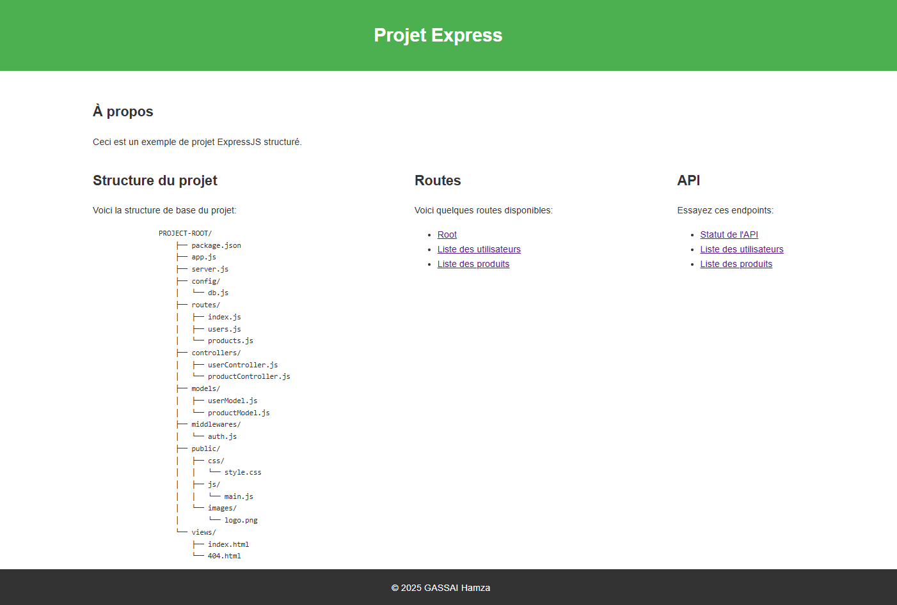

# I - Introduction à ExpressJS

## Exercice 1 : Serveur ExpressJS simple

- Créez un serveur ExpressJS qui répond "Hello World" sur la route principale et affiche la date et l'heure actuelles sur la route "/date".

### Étapes :
1. Initialiser le projet :
   ```js
   mkdir serveur-express
   cd serveur-express
   npm init -y
   npm install express
    ```
2. Créer le fichier index.js :
```js
const express = require('express');
const app = express();
const PORT = 3000;

app.get('/', (req, res) => {
  res.send('Hello World');
});

app.get('/date', (req, res) => {
  res.send(`Date actuelle : ${new Date().toString()}`);
});

app.listen(PORT, () => {
  console.log(`Serveur sur http://localhost:${PORT}`);
});
```

3. Lancer le serveur
 ```bash
 node index.js
```

## Exercice 2 : Projet ExpressJS structuré

- Créez un projet ExpressJS complet avec la structure de répertoires recommandée et configurez-le pour servir des fichiers statiques et gérer différentes routes.



# II - Routage avec ExpressJS
## Exercice 1

Créez une API RESTful pour gérer une liste de tâches avec les routes suivantes :

GET /tasks - Récupérer toutes les tâches
GET /tasks/:id - Récupérer une tâche spécifique
POST /tasks - Créer une nouvelle tâche
PUT /tasks/:id - Mettre à jour une tâche existante
DELETE /tasks/:id - Supprimer une tâche

# Documentation de l'API

## API de Gestion de Tâches

### Récupérer toutes les tâches
**GET /tasks**

Retourne la liste de toutes les tâches.

**Réponse**
```json
[
  {
    "id": 1,
    "title": "Créer l'API",
    "description": "Implémenter l'API RESTful pour gérer les tâches",
    "status": "en cours",
    "created_at": "2025-05-03T10:00:00Z",
    "updated_at": "2025-05-03T10:00:00Z"
  }
]
```

### Récupérer une tâche spécifique
**GET /tasks/:id**

Retourne les détails d'une tâche spécifique.

**Paramètres**
- `id` (obligatoire) - ID de la tâche à récupérer

**Réponse**
```json
{
  "id": 1,
  "title": "Créer l'API",
  "description": "Implémenter l'API RESTful pour gérer les tâches",
  "status": "en cours",
  "created_at": "2025-05-03T10:00:00Z",
  "updated_at": "2025-05-03T10:00:00Z"
}
```

### Créer une nouvelle tâche
**POST /tasks**

Crée une nouvelle tâche.

**Corps de la requête**
```json
{
  "title": "Nouvelle tâche",
  "description": "Description de la nouvelle tâche",
  "status": "à faire"
}
```

**Champs**
- `title` (obligatoire) - Titre de la tâche
- `description` (optionnel) - Description détaillée de la tâche
- `status` (optionnel, défaut: "à faire") - Statut de la tâche

**Réponse**
```json
{
  "id": 4,
  "title": "Nouvelle tâche",
  "description": "Description de la nouvelle tâche",
  "status": "à faire",
  "created_at": "2025-05-03T10:30:00Z",
  "updated_at": "2025-05-03T10:30:00Z"
}
```

### Mettre à jour une tâche
**PUT /tasks/:id**

Met à jour une tâche existante.

**Paramètres**
- `id` (obligatoire) - ID de la tâche à mettre à jour

**Corps de la requête**
```json
{
  "title": "Tâche mise à jour",
  "description": "Description mise à jour",
  "status": "terminé"
}
```

**Champs**
- `title` (optionnel) - Nouveau titre de la tâche
- `description` (optionnel) - Nouvelle description de la tâche
- `status` (optionnel) - Nouveau statut de la tâche

**Réponse**
```json
{
  "id": 1,
  "title": "Tâche mise à jour",
  "description": "Description mise à jour",
  "status": "terminé",
  "created_at": "2025-05-03T10:00:00Z",
  "updated_at": "2025-05-03T11:00:00Z"
}
```

### Supprimer une tâche
**DELETE /tasks/:id**

Supprime une tâche existante.

**Paramètres**
- `id` (obligatoire) - ID de la tâche à supprimer

**Réponse**
```json
{
  "message": "Tâche supprimée avec succès"
}
```

## API de Blog

### Récupérer les articles par année/mois
**GET /posts/:year/:month?**

Retourne les articles publiés durant une année spécifique et optionnellement durant un mois spécifique.

**Paramètres**
- `year` (obligatoire) - Année de publication (ex: 2025)
- `month` (optionnel) - Mois de publication (1-12)

**Réponse**
```json
[
  {
    "id": 1,
    "title": "Introduction à Express.js",
    "content": "Express.js est un framework web pour Node.js...",
    "author_id": 1,
    "created_at": "2025-01-15T08:30:00Z",
    "updated_at": "2025-01-15T08:30:00Z"
  }
]
```

### Récupérer les articles par catégorie
**GET /categories/:categoryName/posts**

Retourne tous les articles appartenant à une catégorie spécifique.

**Paramètres**
- `categoryName` (obligatoire) - Nom de la catégorie (ex: "Technologie")

**Réponse**
```json
[
  {
    "id": 3,
    "title": "RESTful API Best Practices",
    "content": "Les meilleures pratiques pour concevoir des API RESTful...",
    "author_id": 1,
    "created_at": "2025-03-10T14:20:00Z",
    "updated_at": "2025-03-10T14:20:00Z"
  }
]
```


